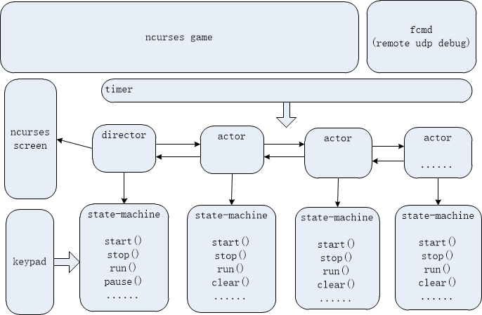

# stm_os
stm_os is a event-driven library, use event to trig a state-machine.
It is a portable, cross-compilable, with a compatible API.
Use this to design ncurses game!

# framework

# how to use
make
./app.elf
use keypad to play tetris.
>	      up
	left down right
	p(pause)    q(quit)    space(hard drop)

# example
tetris game is a example for stm test.

stm is a mechanical Programming model, that's easy to design each state and transition action.